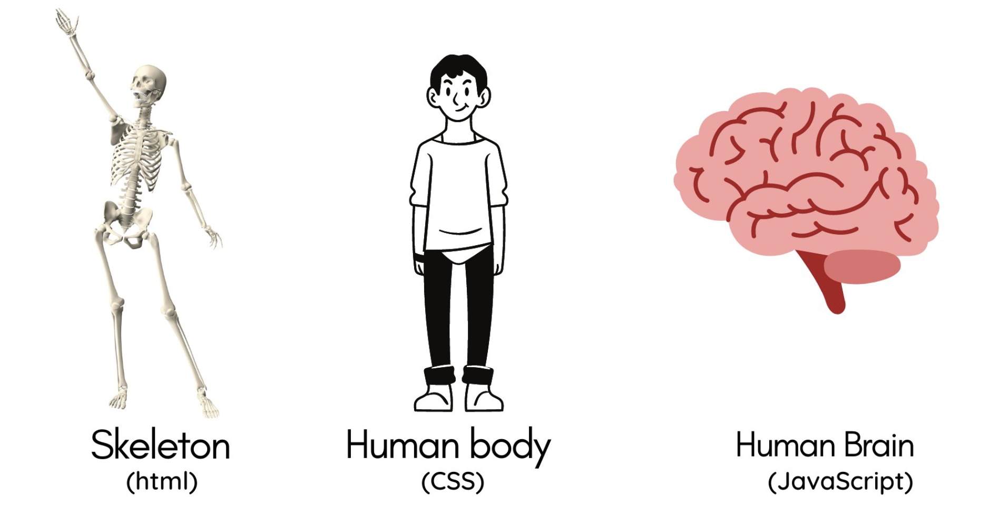

<h1 align="center"> Web Discovery Piscine - 42Madrid </h1>

 

    En este repositorio encontrarás los proyectos desarrollados durante la Piscina Discovery Web en <a, href="https://www.42madrid.com/">42Madrid</a>, además de una recopilación de tutoriales y artículos que te ayudarán a completar los ejercicios.

<!--FOTO 42 CEREBRO-->

## Lenguajes de programación

 

	- Shell / Bash

		Durante los primeros días de la discovery, aprenderás a usar la 
		terminal, esto te ayudará a moverte mucho más rápido a la hora 
		de programar. 
		El lenguaje Bash, te permitirá crear tus primeros programas y
		automatizar tareas pequeñas.

	- HTML5
  
		El lenguaje más importante para una web, la estructura básica de
		toda página. Aprender este lenguaje te permitirá maquetar contenidos.

	- CSS
  
		Cascading StyleSheets, se traduce como "Hojas de estilo en cascada".
		Este lenguaje te permitirá dar forma al HTML, podrás ordenar, darle color
		y forma a la página.

	- JavaScript
  
		Este lenguaje te permite dar funcionalidades a la web, programar acciones...
		en conclusión, añade interactividad a la web.
		
 

Ejemplo visual diferencias entre HTML, CSS y JavaScript

 

 

# Tutoriales y recursos

## EDITOR DE CÓDIGO

Para esta piscina recomiendo utilizar Visual Studio Code [(VSCode)](https://code.visualstudio.com/), es un editor de código muy facil de aprender a utilizar, nos permitirá lanzar nuestro primer *"Hola Mundo"*.
 
 

## 	BASH / SHELL

[🟨 Video - Cómo utilizar la TERMINAL](https://www.youtube.com/watch?v=yra-6WrYA_Y)

 Lista de Comandos Básicos Bash

 

<table>
	<tbody>
		<tr>
			<td><strong>ls</strong></td>
			<td>Lista directorios</td>
		</tr>
		<tr>
			<td><strong>cd</strong></td>
			<td>Cambia el directorio actual de trabajo</td>
		</tr>
		<tr>
			<td><strong>cp</strong></td>
			<td>Copia contenido desde un origen a un destino</td>
		</tr>
			<tr><td><strong>mkdir</strong></td>
			<td>Crea un directorio</td></tr>
		<tr>
			<td><strong>rm</strong></td>
			<td>Borra ficheros o directorios</td>
		</tr>
			<tr><td><strong>mv</strong></td>
			<td>Mueve elementos o les cambia el nombre</td>
		</tr>
		<tr>
			<td><strong>touch</strong></td>
			<td>Crea un fichero vacío</td>
		</tr>
		<tr>
			<td><strong>man</strong></td>
			<td>Consulta la ayuda más común, las páginas man</td>
		</tr>
		<tr>
		<tr>
			<td><strong>clear</strong></td>
			<td>borra la pantalla</td>
		</tr>
		<tr>
			<td><strong>history</strong></td>
			<td>Muestra las últimas instrucciones ejecutadas</td>
		</tr>
		<tr>
			<td><strong>pwd</strong></td>
			<td>Muestra el directorio actual de trabajo</td>
		</tr>
		<tr>
			<td><strong>chmod</strong></td>
			<td>cambia los permisos de un fichero o directorio</td>
		</tr>
		<tr>
			<td><strong>cat</strong></td>
			<td>Ver el contenido de un fichero de texto</td>
		</tr>
	</tbody>
</table>

 

## HTML y CSS
[🟨 Video - Aprende HTML ahora!](https://www.youtube.com/watch?v=MJkdaVFHrto)

[🟨 Video - Aprende CSS ahora!](https://www.youtube.com/watch?v=wZniZEbPAzk)

[📒 Web(Inglés) - Tutorial completo para principiantes HTML y CSS](https://www.internetingishard.com/html-and-css/)

 

## JAVASCRIPT
[🟨 CURSO DE JAVASCRIPT COMPLETO DESDE CERO en español (2022)](https://www.youtube.com/watch?v=S9ojNaeC1RI)

[🟨 Aprende JavaScript en 15 Minutos](https://www.youtube.com/watch?v=Q9fwkpxr3Dw)

 

# Módulos Piscina
 

✅ [Cellule0 ](./Cellule0-Shell) -> Shell / Bash

✅ [Cellule1 ](./Cellule1-Web) -> HTML y CSS

✅ [Cellule2 ](./Cellule2-Web) -> HTML, CSS Y JAVASCRIPT

✅ [Cellule3 ](./Cellule3-Web) -> HTML, CSS Y JAVASCRIPT

✅ [Cellule4 ](./Cellule4-Rush) -> HTML, CSS Y JAVASCRIPT (RUSH)

 
