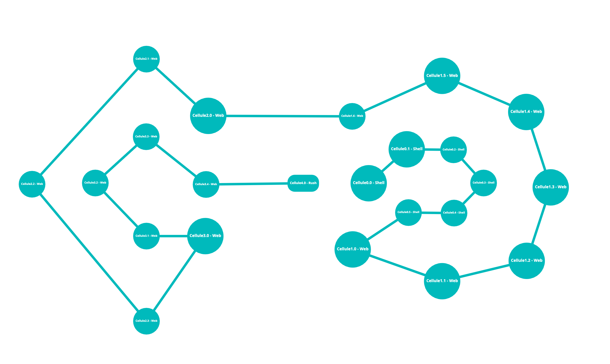

<h1 align="center"> Web Discovery Piscine - 42Madrid </h1>

 

    En este repositorio encontrarás los proyectos desarrollados durante la Piscina Discovery Web en <a, href="https://www.42madrid.com/">42Madrid</a>, además de una recopilación de tutoriales y artículos que te ayudarán a completar los ejercicios.

<!--FOTO 42 CEREBRO-->

## Lenguajes de programación

 

	- Shell / Bash

		Durante los primeros días de la discovery, aprenderás a usar la 
		terminal, esto te ayudará a moverte mucho más rápido a la hora 
		de programar. 
		El lenguaje Bash, te permitirá crear tus primeros programas y
		automatizar tareas pequeñas.

	- HTML5
  
		El lenguaje más importante para una web, la estructura básica de
		toda página. Aprender este lenguaje te permitirá maquetar contenidos.

	- CSS
  
		Cascading StyleSheets, se traduce como "Hojas de estilo en cascada".
		Este lenguaje te permitirá dar forma al HTML, podrás ordenar, darle color
		y forma a la página.

	- JavaScript
  
		Este lenguaje te permite dar funcionalidades a la web, programar acciones...
		en conclusión, añade interactividad a la web.
		
 

Ejemplo visual diferencias entre HTML, CSS y JavaScript

 

 

## Partes del proyecto

 🔸 Cellule0 -> Shell / Bash

	[Cellule0](./Cellule0%20-%20Shell)

 🔸 Cellule1 -> Html5 y CSS

🔸 Cellule2 -> Hmtl5, CSS y Javascript

 🔸 Cellule3 -> Hmtl5, CSS y Javascript

 🔸 Cellule4 -> Rush

